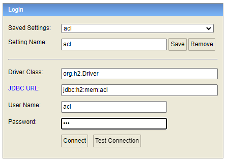

# acl.back
acl challenge - backend

## Requirements

The project makes use of Gradle and uses the [Gradle wrapper] which means you don't need Gradle installed.


### Build the project

Compiles the project, runs the test and then creates an executable JAR file

```console
$ ./gradlew build
```
### Run the application

Run the application which will be listening on port `8080`.

```console
$ ./gradlew bootRun
```

### Stop the application

Stop all daemons running

```console
$ ./gradlew -stop
```

### API Swagger

With the application running open the below url from a browser 

```console
http://localhost:8080/swagger-ui/index.html
```

## DATABASE
The database engine used is H2 in memory DB

To open the H2 portal and manage the Tables, open the url from a browser

```console
http://localhost:8080/h2-console/
```

Input the value as below:



Password: acl


## API

Below is the API endpoint with the input and output. Please note that the application needs to be
running for the following endpoints to work.

### Task Creation

Endpoint

```text
POST /api/v1/task/create
```

Example of body

```json
{
  "description": "My Description"
}
```
Example output

```json
{
    "id": 1,
    "description": "My description",
    "created": "2024-06-12T02:13:08.364617",
    "isvalid": true
}
```
### Task Listing

Endpoint

```text
GET /api/v1/task/
```

Example output

```json
[
    {
        "id": 1,
        "description": "My description",
        "created": "2024-06-12T02:12:59.757725",
        "isvalid": true
    },
    {
        "id": 2,
        "description": "My description",
        "created": "2024-06-12T02:13:08.364617",
        "isvalid": true
    }
]
```
### Task Update

Endpoint

```text
PUT /api/v1/task
```

Example of body

```json
{
  "id": 1,
  "description": "My description updated",
  "isvalid": false
}
```
Example output

```json
{
  "id": 1,
  "description": "My description updated",
  "created": "2024-06-13T14:39:54.665821",
  "isvalid": false,
  "isdeleted": false
}
```

### Task Deletion

Endpoint

```text
PUT /api/v1/task/delete/{id}
```

Input variable

id: The identification number of the task to delete


Example output

```json
{
  "id": 1,
  "description": "My description updated",
  "created": "2024-06-13T14:39:54.665821",
  "isvalid": false,
  "isdeleted": true
}
```